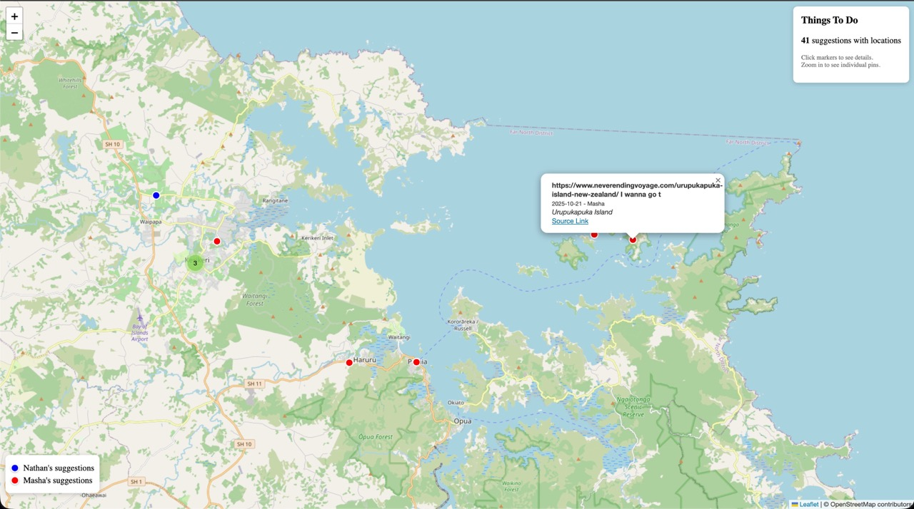

# WhatsApp Things To Do

Extract "things to do" suggestions from your WhatsApp chat history and visualize them on a map.




## What It Does

This tool parses a WhatsApp chat export and finds all the times you and your chat partner said things like:
- "We should go to..."
- "Let's try..."
- "Wanna visit..."
- "This looks fun!"

It then:
1. Extracts suggestions using regex patterns and semantic search
2. Geocodes locations mentioned (biased to New Zealand, but configurable)
3. Exports to CSV/Excel spreadsheet
4. Generates an interactive map with all geocoded suggestions

## Sample Output

### Spreadsheet
| Date | Sender | Activity | Location | Coordinates |
|------|--------|----------|----------|-------------|
| 2024-04-05 | Person A | Wanna go to bay of islands for our anniversary? | Bay of Islands | -35.21, 174.21 |
| 2024-10-11 | Person B | Let's go for a hike this weekend in Karangahake Gorge | Karangahake Gorge | -37.42, 175.72 |

### Interactive Map
- Clustered markers that expand on zoom
- Color-coded by sender
- Popups with activity details and source links

## Quick Start

### 1. Export Your WhatsApp Chat

On your phone:
1. Open the WhatsApp chat
2. Tap ⋮ (menu) → More → Export chat
3. Choose "Without media" (or "With media" if you want images)
4. Save the `.zip` file

### 2. Clone and Setup

```bash
git clone https://github.com/yourusername/whatsapp_things_to_do.git
cd whatsapp_things_to_do

# Create virtual environment
python3 -m venv .venv
source .venv/bin/activate

# Install dependencies
pip install -r requirements.txt
```

### 3. Configure API Keys

Copy the example env file and add your API keys:

```bash
cp .env.example .env
```

Edit `.env`:
```
OPENAI_API_KEY=sk-...
GOOGLE_MAPS_API_KEY=AIza...
ANTHROPIC_API_KEY=sk-ant-...  # Optional, for better classification
```

**Required APIs:**
- **OpenAI** - For embeddings (~$0.02 for 15k messages)
- **Google Maps** - Enable "Geocoding API" and "Places API" in Google Cloud Console

**Optional:**
- **Anthropic** - For Claude-based classification of ambiguous suggestions

### 4. Extract Your Chat

```bash
# Unzip to data folder
unzip ~/Downloads/"WhatsApp Chat - Your Chat.zip" -d data/

# Rename if needed
mv data/_chat.txt data/_chat.txt
```

### 5. Run the Pipeline

```bash
source .venv/bin/activate

# Parse the chat
python src/parser.py

# Extract suggestions (regex-based)
python src/suggestion_extractor.py

# Resolve Google Maps URLs
python src/google_maps_resolver.py

# Generate embeddings for semantic search
python src/embeddings.py

# Classify with Claude (optional, improves accuracy)
python src/classifier.py

# Geocode locations
python src/geocoder.py

# Export to CSV, Excel, and map
python src/export.py
```

### 6. View Results

```bash
open output/map.html           # Interactive map
open output/suggestions.xlsx   # Spreadsheet
```

## Project Structure

```
whatsapp_things_to_do/
├── .env.example          # API key template
├── requirements.txt      # Python dependencies
├── PRD.txt              # Product requirements doc
├── CLAUDE.md            # AI assistant guidelines
├── TODO.md              # Progress tracking
├── data/
│   ├── _chat.txt        # Your WhatsApp export (gitignored)
│   └── chat.db          # SQLite database (gitignored)
├── src/
│   ├── parser.py                 # WhatsApp export parser
│   ├── suggestion_extractor.py   # Regex-based extraction
│   ├── google_maps_resolver.py   # Google Maps URL geocoding
│   ├── embeddings.py             # OpenAI embeddings + semantic search
│   ├── classifier.py             # Claude-based classification
│   ├── geocoder.py               # Text location geocoding
│   ├── export.py                 # CSV/Excel/Map generation
│   └── test_api_keys.py          # API verification
└── output/
    ├── suggestions.csv
    ├── suggestions.xlsx
    └── map.html
```

## How It Works

### 1. Parsing
Parses WhatsApp iOS/Android export format:
```
[10/11/23, 9:36:36 PM] Person A: We should go to a play or something
```

### 2. Suggestion Detection (Multi-pass)

**Pass 1: Regex Patterns**
- "we should", "let's go", "wanna go", "want to try"
- "bucket list", "must visit", "would be fun"

**Pass 2: URL-based**
- Google Maps links → extract coordinates
- Airbnb/Booking links → travel suggestions
- TikTok/YouTube with suggestion context

**Pass 3: Semantic Search**
- Embeds all messages with OpenAI
- Searches for messages similar to activity phrases
- Identifies ~500-1000 candidates

**Pass 4: LLM Classification (Optional)**
- Claude classifies ambiguous candidates
- Extracts activity description and location

### 3. Geocoding
- Extracts coordinates from Google Maps URLs
- Geocodes place names with Google Geocoding API
- Biased to your region (default: New Zealand)

### 4. Export
- CSV with all columns
- Excel with formatted columns
- Interactive Leaflet.js map with clustering

## Customization

### Change Region Bias

Edit `src/geocoder.py` to change the location bias:

```python
# NZ places - replace with your region
NZ_REGIONS = [
    "auckland", "wellington", "queenstown", ...
]
```

And in `geocode_location()`:
```python
address = f"{location}, Your Country"
```

### Add Custom Patterns

Edit `src/suggestion_extractor.py`:

```python
SUGGESTION_PATTERNS = [
    SuggestionPattern(
        "your_pattern",
        re.compile(r"\byour regex\b", re.IGNORECASE),
        0.85,  # confidence
        "Description"
    ),
    ...
]
```

### Exclude Patterns

Add patterns to ignore (work, chores, etc.):

```python
EXCLUDE_PATTERNS = [
    re.compile(r"\b(work|meeting|email)\b", re.IGNORECASE),
    ...
]
```

## Cost Estimates

| Service | ~15k Messages |
|---------|---------------|
| OpenAI Embeddings | ~$0.02 |
| Google Geocoding | ~$0.50 |
| Google Places | ~$0.10 |
| Claude (Haiku) | ~$0.50 |
| **Total** | **~$1-2** |

## Limitations

- **TikTok**: Can't extract video descriptions (API restrictions)
- **False positives**: "We should" catches some non-activity suggestions
- **WhatsApp links**: No way to deep-link back to specific messages
- **Media**: Images/videos not analyzed (could add Vision API)

## Contributing

PRs welcome! Some ideas:
- [ ] Vision API for image analysis
- [ ] Voice message transcription
- [ ] Google My Maps export
- [ ] "Mark as done" web UI
- [ ] Support for other chat exports (Telegram, iMessage)

## License

MIT

---

Built with Claude Code 🤖
